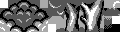

### Unused Battle Transition (SW 97)

In the Spaceworld 1997 demo, four transition types can be seen. Three of which (wavy, clockwise wipe, speckle) make it to the final game, and an additional one (scanlines) that can be seen in demo footage. These transitions are triggered at random on every battle (wild or trainer).

However, there is an additional transition present in the ROM, which looks like folding blinds. This transition type is never seen under any normal circumstance.

<video controls width="250">
	<source src="img/sw97_transition.webm" type="video/webm">
</video>

To see this transition on every encounter, replace 4 bytes in the SW'97 ROM, starting at address `0x8C5C6` (`23:45C6`) with `08 08 08 08`. Alternatively, you can enter these Game Genie codes:

* `085-C6B-E6E`
* `085-C7B-91E`
* `085-C8B-D56`
* `085-C9B-B32`

### Sweet Kiss and Curse (SW 99)

In the Spaceworld 1999 demo, the sprites for the Sweet Kiss and Curse
animation look less cartoony. It is also present in the source code under `EFFDATA/GHOSTCHR.DAT`.

| Spaceworld 1999                    | Final                                             |
| ---------------------------------- | ------------------------------------------------- |
|  |                   |

### Early Intro Graphics

In the G/S source, an even earlier iteration of the intro sequence graphics can be found.

They might have looked something like this...

| Reconstructed from backup | SW'97 | Final |
| :-:  | :-: | :-: |
|   |   |   |

(Mockups: <a href="https://twitter.com/KmiE_821/">Farore</a>, modified by Zumi)

#### Jigglypuff

This earlier iteration of the intro Jigglypuff can be found under `EFFDATA/PURIN_D.DAT`. It has no shading, and the frames are larger than either the sprites in Spaceworld 1997 nor the final.

| Backup sprites | SW'97 | Final |
| :-:  | :-: | :-: |
|  |  |  |

#### Lapras and Magikarp

An earlier iteration of Lapras and the Magikarp sprites are found under `EFFDATA/DEMORAPU.DAT` and `EFFDATA/FISHCHR.DAT`, respectively. The Magikarp in this iteration seem to look more like generic fish sprites.

| Backup sprites | SW'97 | Final |
| :-:  | :-: | :-: |
|  |  |  |

#### Sea

The sea floor, which can be found under `EFFDATA/SEA_CHR1.DAT` is similar to the one used in Spaceworld 1997, with the exception of an added rock on the left side of the screen and different weed positioning. The clouds also look pretty similar to the ones seen in the demo, with minor touchups and and overall palette brightening.

The wave animation can be found separately, under `EFFDATA/NAMI_EX.DAT`. As with the clouds, it seems to have only minor touchups.

| Backup sprites | SW'97 | Final |
| :-:  | :-: | :-: |
|  |  |  |

#### Forest

The early forest background, located in `EFFDATA/MORI_CHR.DAT`, might have been laid out quite differently, as it appears to use more tiles than what was present in Spaceworld 1997.

| Backup sprites | SW'97 | Final |
| :-:  | :-: | :-: |
|  |  |  |

