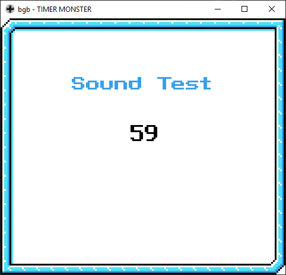

**Shi Kong Xing Shou** is your average monster-hunter game for the Game Boy Color. A favorite among Vast Fame's other output, yet cobbled together with subpar code and duct tape.

## Sound Test
A hidden soundtest routine can be found in GameBoy address `62:5f9c`. There is not yet a known code to access it.

## Cheat Codes
There are several cheat codes that can be entered in the title screen.

* Up, A, A, Up, B, B, Select, Select: 99,999 money
* Down, Down, Left, Right, Select, A, Select, B: Same as above, but add 2 x Bali Fruit, 99 + 99 x Magic Fruit, 99 x Shrink Ray.
* Left, Left, Right, Right, Up, Up, Down, Down: Clears SRAM.
* Right, B, B, B, Left, A, A, A: Same as the money+items cheat.
* Left, Left, Right, Right, Up, Up, Down, Down: Also clears SRAM
